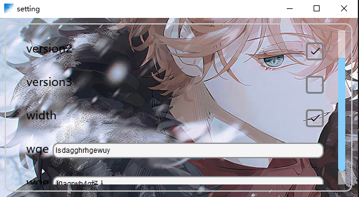
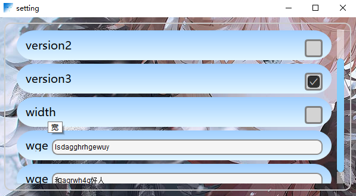

<!--
 * @encode: utf-8
 * @Date: 2025-08-22 21:17:17
 * @LastEditTime: 2025-08-24 14:37:46
 * @FilePath: /TDSetting/Qt/setting/README.md
-->
# 极简设置

这是一个基于`Qt`项目的程序


### 安装:
由于项目的`releases`编译时使用的是动态链接

暂时需要将程序与依赖放在一起

需要安装相关`Qt`的依赖,依赖被包含在`Minimalist-settings.7z`和`Setup.exe`中

直接使用安装包安装,或者解压压缩包即可使用

### 使用:

使用yaml格式的配置文件

格式如下:

需要图形化配置的,在`#`注释中使用//$ title: 标题; detail: 详细描述; type: 类型

标题与详细描述可以填写除了`;`以外的任意字符
`type`字段为可选,`bool`或者`string`
`bool`类型适用于`n: false`这种
`string`则适用以`"`或者`'`包裹字符串

使用示例:
```
name: Setting
version: false      # //$ title: version; detail: 版本信息; type: bool
version: false      # //$ title: version2; detail: 版本信息2; type: bool
version: true      # //$ title: version3; detail: 版本信息3; type: bool

window:
  width: false    # //$ title: width; detail: 宽; type: bool

wge: "lsdagghrhgewuy"   # //$ title: wge; detail: wget; type: string
wgw: "和agrwh4g好人" # //$ title: wge; detail: wget; type: string
```

通过命令行传递文件路径

打开命令`setting.exe test.yaml`

图形化显示:



好像有点丑,hh

v1.0的UI样式:



### 编译:
1. 在创建`images`目录,并添加一个`background.png`的图像作为背景

2. 使用`Qt Creator 17.0.0 (Community)`直接构建即可

